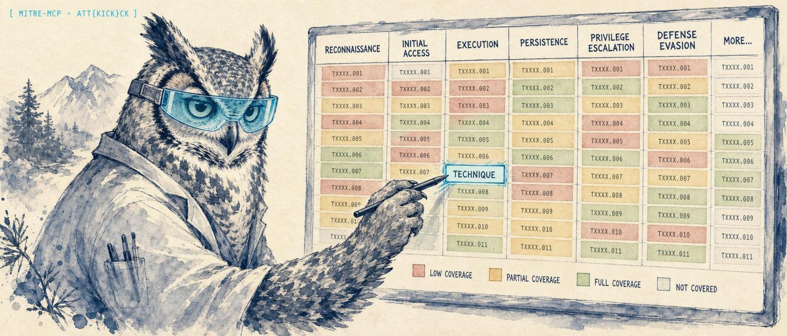

<p align="center">
  
</p>

<h1 align="center">mitre-mcp</h1>

<p align="center">
  <strong>An MCP server that puts the full MITRE ATT&CK knowledge base in front of your AI client, then connects it to your live SOC stack so an agent can map an alert to a technique, profile the group behind it, and find the gap in your detection coverage in one conversation.</strong>
</p>

<p align="center">
  <a href="https://lidless.dev/mitre-mcp"><strong>Website &amp; docs &rarr; lidless.dev/mitre-mcp</strong></a>
</p>

<p align="center">
  
  
  
  
  
</p>

mitre-mcp is an [MCP](https://modelcontextprotocol.io/) server for the [MITRE ATT&CK](https://attack.mitre.org/) knowledge base. It exists because asking an LLM about adversary techniques from memory gives you stale, hallucinated technique IDs, while a SOC analyst needs the real, versioned ATT&CK data and the alerts in front of them. Unlike a plain ATT&CK lookup tool, mitre-mcp ships ATT&CK querying and live SOC integration (Wazuh, TheHive, Cortex, MISP) in the same server, so an agent can map a real alert to a technique and correlate it across your stack without leaving the chat.

## What it does

mitre-mcp gives an AI client structured, offline-capable access to MITRE ATT&CK: techniques, tactics, threat groups, software, mitigations, data sources, and campaigns, sourced from the official MITRE STIX 2.1 bundles and cached locally. On top of that knowledge base it adds threat-modeling and SOC workflow tools: it maps security alerts to likely ATT&CK techniques, analyzes detection coverage against your available data sources, profiles campaigns and attributes them to groups, and exports ATT&CK Navigator layer JSON for heatmaps and group overlays.

It also connects to a running SOC stack. Optional integrations for Wazuh, TheHive, Cortex, and MISP let an agent map live Wazuh alerts to techniques, enrich and open TheHive cases with ATT&CK context, map Cortex analyzers to data sources, pull ATT&CK out of MISP galaxies, and cross-correlate one set of techniques across all of them at once. SOC integrations are entirely optional: with no credentials configured, mitre-mcp is a pure read-only ATT&CK server. Keywords for the curious: MITRE ATT&CK, MCP server, threat intelligence, threat modeling, detection coverage, ATT&CK Navigator, Wazuh, TheHive, Cortex, MISP, STIX 2.1, SOC.

## Quickstart

mitre-mcp is published on npm and runs with no install via `npx`. The fastest path is to register it with your MCP client.

### Claude Code

```bash
claude mcp add mitre-attack --env MITRE_MATRICES=enterprise -- npx -y mitre-mcp
```

Add `--scope user` to make it available from any directory. Add `--env` flags for any SOC integrations you want to enable.

### Claude Desktop

Add this to `~/Library/Application Support/Claude/claude_desktop_config.json` (macOS) or `%APPDATA%\Claude\claude_desktop_config.json` (Windows). This is the minimal, ATT&CK-only configuration:

```json
{
  "mcpServers": {
    "mitre-attack": {
      "command": "npx",
      "args": ["-y", "mitre-mcp"],
      "env": {
        "MITRE_MATRICES": "enterprise"
      }
    }
  }
}
```

To enable the optional SOC integrations, add the relevant environment variables. Example hosts below use the [RFC 5737](https://datatracker.ietf.org/doc/html/rfc5737) documentation address `192.0.2.10`; replace them with your own:

```json
{
  "mcpServers": {
    "mitre-attack": {
      "command": "npx",
      "args": ["-y", "mitre-mcp"],
      "env": {
        "MITRE_MATRICES": "enterprise",
        "WAZUH_URL": "https://192.0.2.10:55000",
        "WAZUH_USERNAME": "wazuh-wui",
        "WAZUH_PASSWORD": "your-password",
        "THEHIVE_URL": "http://192.0.2.10:9000",
        "THEHIVE_API_KEY": "your-api-key",
        "CORTEX_URL": "http://192.0.2.10:9001",
        "CORTEX_API_KEY": "your-api-key",
        "MISP_URL": "https://192.0.2.10",
        "MISP_API_KEY": "your-api-key"
      }
    }
  }
}
```

The first run downloads the ATT&CK STIX bundles and caches them under `~/.mitre-mcp/data`; subsequent runs are offline until the next refresh.

### From source

```bash
git clone https://github.com/lidless-labs/mitre-mcp.git
cd mitre-mcp
npm install
npm run build
npm test          # optional: run the test suite
```

Other clients (OpenClaw, Hermes, Codex CLI) are covered under [Other MCP clients](#other-mcp-clients).

## Tools

mitre-mcp registers **39 tools**, **3 resources**, and **4 prompts**. The 19 core ATT&CK tools work with no configuration; the 18 SOC tools require the matching integration to be configured (the 2 cross-stack tools degrade gracefully to whatever is connected).

### Core ATT&CK tools (19)

| Tool | Description |
|------|-------------|
| `mitre_get_technique` | Get full details of a technique by ID (T1059, T1059.001) |
| `mitre_search_techniques` | Search techniques by keyword, tactic, platform, data source |
| `mitre_list_tactics` | List all tactics in kill-chain order |
| `mitre_get_tactic` | Get tactic details with all associated techniques |
| `mitre_get_group` | Get group details including techniques and software used |
| `mitre_search_groups` | Search groups by keyword or technique usage |
| `mitre_list_groups` | List all known threat groups |
| `mitre_get_software` | Get software details with techniques and associated groups |
| `mitre_search_software` | Search software by name, technique, or type (malware/tool) |
| `mitre_get_mitigation` | Get mitigation details with addressed techniques |
| `mitre_mitigations_for_technique` | Get all mitigations for a specific technique |
| `mitre_search_mitigations` | Search mitigations by keyword |
| `mitre_get_datasource` | Get data source details with detectable techniques |
| `mitre_detection_coverage` | Analyze detection coverage based on available data sources |
| `mitre_map_alert_to_technique` | Map security alerts to likely ATT&CK techniques |
| `mitre_technique_overlap` | Find technique overlap between groups for attribution |
| `mitre_attack_path` | Generate possible attack paths through the kill chain |
| `mitre_update_data` | Force update of the local ATT&CK data cache |
| `mitre_data_version` | Get current data version and object counts |

### Campaign tools (4)

| Tool | Description |
|------|-------------|
| `mitre_campaign_profile` | Build a technique profile with group/software/campaign matching |
| `mitre_get_campaign` | Get campaign details with techniques, software, and groups |
| `mitre_list_campaigns` | List all known ATT&CK campaigns |
| `mitre_search_campaigns` | Search campaigns by keyword or technique |

### Navigator layer export (1)

| Tool | Description |
|------|-------------|
| `mitre_navigator_layer` | Generate ATT&CK Navigator JSON layers (coverage, group, campaign, diff) |

### Wazuh integration (4)

| Tool | Description |
|------|-------------|
| `mitre_wazuh_status` | Wazuh manager status, agents, and rule stats |
| `mitre_map_wazuh_alert` | Map Wazuh alerts to ATT&CK techniques by rule ID/description/groups |
| `mitre_wazuh_rule_coverage` | Analyze Wazuh rules mapped to ATT&CK techniques |
| `mitre_wazuh_alerts` | Fetch recent alerts enriched with ATT&CK context |

### TheHive integration (3)

| Tool | Description |
|------|-------------|
| `mitre_thehive_enrich` | Enrich a TheHive case with ATT&CK techniques and mitigations |
| `mitre_thehive_create_case` | Create a case pre-populated with ATT&CK context (write-gated) |
| `mitre_thehive_list_cases` | List cases with ATT&CK technique filtering |

### Cortex integration (2)

| Tool | Description |
|------|-------------|
| `mitre_cortex_analyzer_coverage` | Map Cortex analyzers to ATT&CK data sources |
| `mitre_cortex_run_analyzers` | Run analyzers on observables with ATT&CK context (write-gated) |

### MISP integration (4)

| Tool | Description |
|------|-------------|
| `mitre_misp_event_to_attack` | Map MISP event attributes/galaxies to ATT&CK |
| `mitre_misp_search_indicators` | Search MISP IOCs by technique or group |
| `mitre_misp_create_event` | Create events pre-tagged with ATT&CK techniques (write-gated) |
| `mitre_misp_list_events` | List events with ATT&CK enrichment |

### Cross-stack correlation (2)

| Tool | Description |
|------|-------------|
| `mitre_soc_status` | Connection status for all SOC integrations |
| `mitre_cross_correlate` | Search for techniques across Wazuh, TheHive, and MISP simultaneously |

### Resources

| URI | Description |
|-----|-------------|
| `mitre://matrix/enterprise` | Full Enterprise ATT&CK matrix (tactics x techniques) |
| `mitre://version` | Current data version and statistics |
| `mitre://tactics` | All tactics in kill-chain order |

### Prompts

| Prompt | Description |
|--------|-------------|
| `map-incident-to-attack` | Map incident observables to ATT&CK techniques |
| `threat-hunt-plan` | Generate a threat hunting plan |
| `gap-analysis` | Perform detection gap analysis |
| `attribution-analysis` | Assist with threat attribution |

## Configuration

### Core settings

| Variable | Default | Description |
|----------|---------|-------------|
| `MITRE_DATA_DIR` | `~/.mitre-mcp/data` | Local cache directory for STIX bundles |
| `MITRE_MATRICES` | `enterprise` | Comma-separated matrices: `enterprise`, `mobile`, `ics` |
| `MITRE_UPDATE_INTERVAL` | `86400` | Auto-update check interval in seconds (default 24h) |

### SOC integration (all optional)

| Variable | Description |
|----------|-------------|
| `WAZUH_URL` | Wazuh API URL (e.g. `https://192.0.2.10:55000`) |
| `WAZUH_USERNAME` | Wazuh API username (default: `wazuh-wui`) |
| `WAZUH_PASSWORD` | Wazuh API password |
| `WAZUH_VERIFY_SSL` | Verify SSL certs (default: `true`, set `false` for self-signed) |
| `THEHIVE_URL` | TheHive URL (e.g. `http://192.0.2.10:9000`) |
| `THEHIVE_API_KEY` | TheHive API key |
| `CORTEX_URL` | Cortex URL (e.g. `http://192.0.2.10:9001`) |
| `CORTEX_API_KEY` | Cortex API key |
| `MISP_URL` | MISP URL (e.g. `https://192.0.2.10`) |
| `MISP_API_KEY` | MISP API key (authkey) |
| `MISP_VERIFY_SSL` | Verify SSL certs (default: `true`, set `false` for self-signed) |
| `MITRE_SOC_ALLOW_WRITES` | Globally pre-authorize state-changing SOC tools (default: off). When unset, write tools run in dry-run mode unless the call passes `confirm: true`. Set to `true`/`1`/`yes` to allow writes without per-call confirmation. |

### SOC write safety

State-changing SOC tools (`mitre_misp_create_event`, `mitre_thehive_create_case`, and `mitre_cortex_run_analyzers`) default to a **dry run**: they return the action they *would* perform without touching the SOC platform. To actually execute, either:

- pass `confirm: true` in the individual tool call, or
- set `MITRE_SOC_ALLOW_WRITES=true` to pre-authorize all SOC writes for the session.

`mitre_cortex_run_analyzers` is the highest-impact tool (it submits live analyzer jobs, including sandbox detonation, against the supplied observable), so confirm it deliberately. `mitre_thehive_enrich` keeps its existing `addTags` flag (default `false`, read-only analysis) as its write guard.

When SSL verification is disabled (`*_VERIFY_SSL=false`), the relaxed TLS policy is scoped to each individual request and never disables certificate validation globally, so concurrent requests to other hosts remain protected. IDs supplied to SOC tools (event IDs, case IDs, agent IDs, data types) are validated against a strict allow-list and URL-encoded before being placed in API request paths.

## CLI

The same package ships a read-only **search tool**, `attack`, for shells, cron, and CI. It shares the local ATT&CK data core with the MCP server, so what the agent can look up, you can look up from a terminal. It exposes only read/lookup operations; data refresh and SOC correlation stay in the MCP server.

```bash
npx mitre-mcp@latest stats
# or, installed globally:
attack technique T1059          # one technique by ATT&CK id
attack group APT29              # threat actor by id or name
attack tactics                  # list all tactics
attack search "powershell"      # search techniques (--type group|software|mitigation|campaign)
attack mitigations-for T1059    # mitigations mapped to a technique
attack software Cobalt Strike
attack stats                    # ATT&CK data counts + version
attack technique T1059 --json   # raw JSON for piping
```

Run `attack help` for the full command list. `--json` emits raw JSON instead of the concise summary. Exit codes: `0` success, `1` runtime error (data not loaded, or a lookup found nothing), `2` usage error (unknown command/flag or missing argument).

### Starting the MCP server

`attack mcp` (or the back-compat `mitre-mcp` bin) starts the stdio MCP server. If a launcher referenced the file path `dist/index.js` directly, point it at `dist/mcp-bin.js` (or `dist/cli.js mcp`); launchers that use the `mitre-mcp` bin name need no change.

## Examples

Ask your agent in natural language; it picks the tool. A few that work out of the box:

```
Look up T1059.001 and list the mitigations for it.
```

```
Generate an ATT&CK Navigator coverage layer for the data sources
Process, Network Traffic, and File so I can see my detection gaps.
```

```
Compare APT28 (G0007) and APT29 (G0016) as a Navigator diff layer.
```

With a SOC stack connected:

```
Map Wazuh rule 5710 with groups ["sshd", "authentication_failed"]
to ATT&CK techniques, then cross-correlate those techniques across
Wazuh, TheHive, and MISP.
```

## Other MCP clients

### OpenClaw

With the global npm install:

```bash
openclaw mcp set mitre-attack '{
  "command": "npx",
  "args": ["-y", "mitre-mcp"],
  "env": { "MITRE_MATRICES": "enterprise" }
}'
```

Or from a source checkout, point at the built `dist/index.js`:

```bash
openclaw mcp set mitre-attack '{
  "command": "node",
  "args": ["/absolute/path/to/mitre-mcp/dist/index.js"],
  "env": { "MITRE_MATRICES": "enterprise" }
}'
```

Then restart the gateway so the server is picked up:

```bash
systemctl --user restart openclaw-gateway
openclaw mcp list   # confirm "mitre-attack" is registered
```

### Hermes Agent

[Hermes Agent](https://github.com/NousResearch/hermes-agent) reads MCP config from `~/.hermes/config.yaml` under the `mcp_servers` key:

```yaml
mcp_servers:
  mitre-attack:
    command: "npx"
    args: ["-y", "mitre-mcp"]
    env:
      MITRE_MATRICES: "enterprise"
```

Then reload MCP from inside a Hermes session with `/reload-mcp`.

### Codex CLI

[Codex CLI](https://github.com/openai/codex) registers MCP servers via `codex mcp add`:

```bash
codex mcp add mitre-attack --env MITRE_MATRICES=enterprise -- npx -y mitre-mcp
```

Codex writes the entry to `~/.codex/config.toml` under `[mcp_servers.mitre-attack]`. Verify with `codex mcp list`.

## Prerequisites

- Node.js 20 or later
- Internet access for the initial ATT&CK data download (cached locally after the first run)
- (Optional) Wazuh, TheHive, Cortex, and/or MISP instances for SOC integration

## Project structure

```
mitre-mcp/
  src/
    index.ts              # MCP server entry point
    config.ts             # Environment config (core + SOC)
    types.ts              # STIX/ATT&CK type definitions
    resources.ts          # MCP resources
    prompts.ts            # MCP prompts
    data/                 # STIX downloader, parser, and indexed store
    tools/                # Core ATT&CK tool registrations
    soc/                  # Wazuh, TheHive, Cortex, MISP clients + correlation
  tests/                  # Parser, query, mapping, and SOC security tests
```

## Data sources

ATT&CK data is sourced from the official MITRE STIX 2.1 bundles:

- **Enterprise ATT&CK**: Windows, Linux, macOS, Cloud, Network, Containers
- **Mobile ATT&CK**: Android and iOS
- **ICS ATT&CK**: Industrial control systems

Data is downloaded on first run and cached locally. Set `MITRE_UPDATE_INTERVAL` to control how often the server checks for updates.

## Why not something else?

- **A plain "ask the LLM about ATT&CK" prompt** gives you confident, made-up technique IDs and last year's data. mitre-mcp serves the real, versioned STIX bundles MITRE publishes, cached locally and refreshable, so the technique IDs and relationships are correct.
- **A generic ATT&CK API wrapper or the official `mitreattack-python` library** is a great data layer, but it stops at the data. mitre-mcp speaks MCP so any agent can call it, and it carries the analysis tools (alert mapping, coverage analysis, Navigator export, attribution) and the SOC integrations on top.
- **Per-tool SOC plugins** (a Wazuh MCP here, a MISP MCP there) leave you wiring four servers and four mental models. mitre-mcp puts Wazuh, TheHive, Cortex, and MISP behind one ATT&CK-centric server with one correlation tool that spans all of them.
- **A hosted threat-intel SaaS** sends your alerts to someone else's cloud. mitre-mcp runs on your machine, talks only to the SOC hosts you configure, and ships nothing to a third party.

## What mitre-mcp is not

- It is **not a SIEM or a replacement for Wazuh, TheHive, Cortex, or MISP**. It reads from and writes to them through their APIs; it does not store or index your events.
- It is **not an autonomous responder**. State-changing SOC tools dry-run by default and require explicit `confirm: true` or `MITRE_SOC_ALLOW_WRITES=true` before they touch a platform.
- It is **not a hosted service or a daemon**. It is a stdio MCP server your client launches on demand.
- It does **not maintain the ATT&CK data itself**. The knowledge base is MITRE's; mitre-mcp downloads, parses, caches, and serves it.
- It is **not a curated CTI feed**. It serves what MITRE publishes plus what your own SOC platforms contain.

## Contributing

Issues and pull requests are welcome. See [CONTRIBUTING.md](CONTRIBUTING.md) for the contribution path and [SECURITY.md](SECURITY.md) to report a vulnerability privately. By participating you agree to the [Code of Conduct](CODE_OF_CONDUCT.md).

## License

[MIT](LICENSE)
